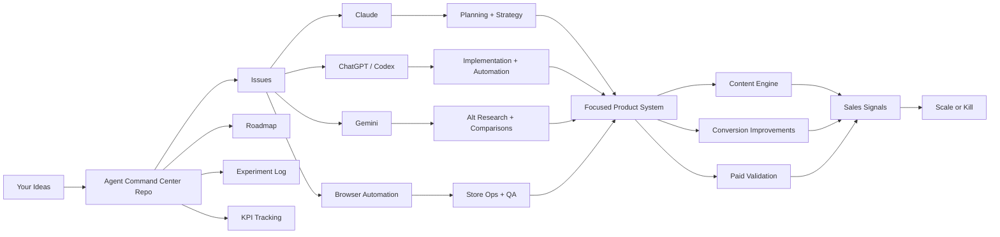
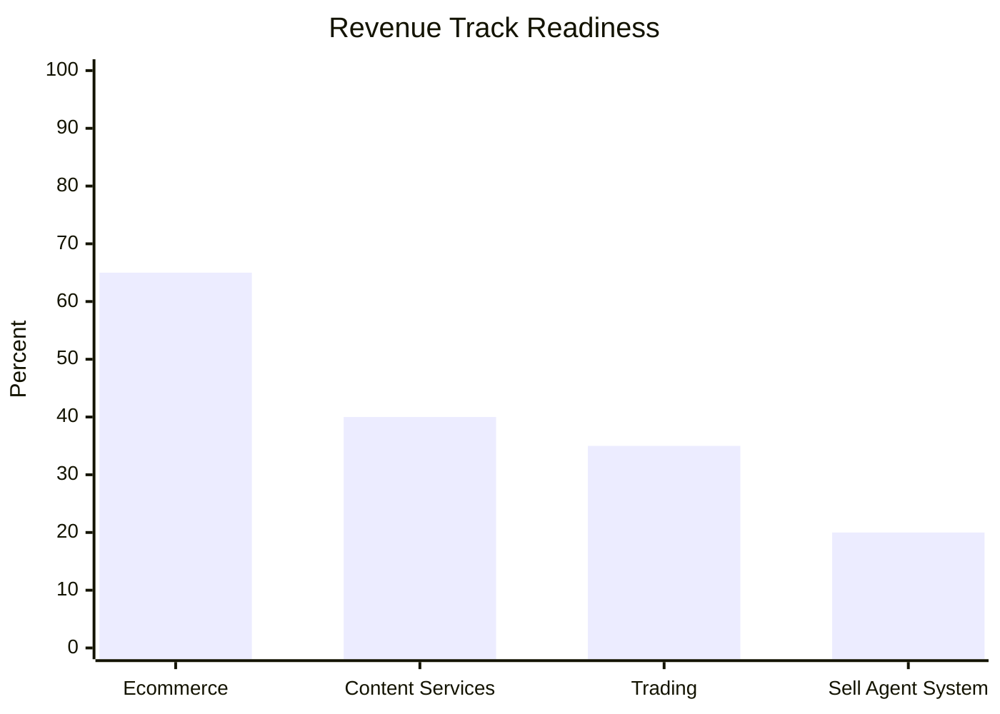
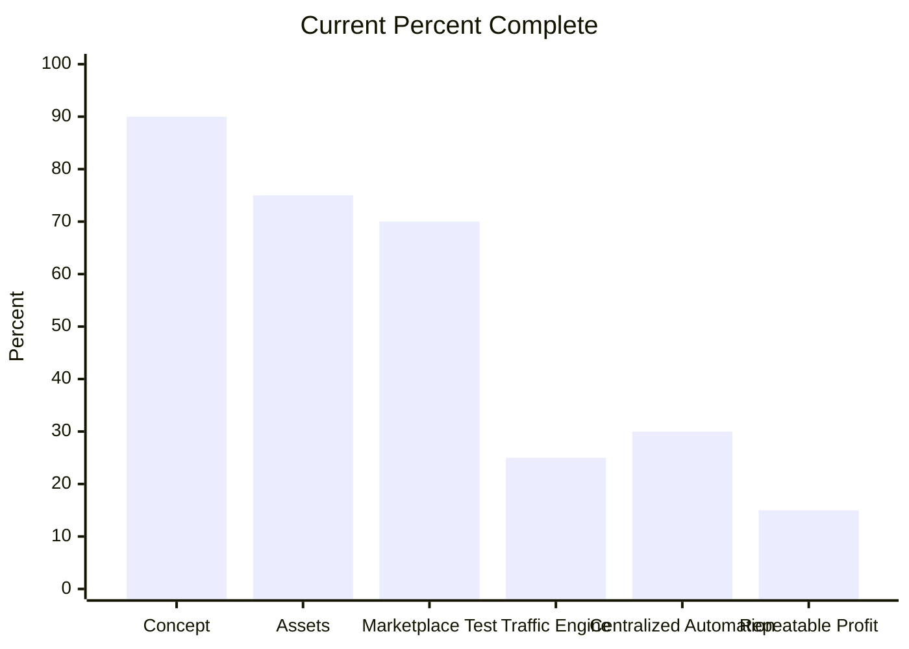
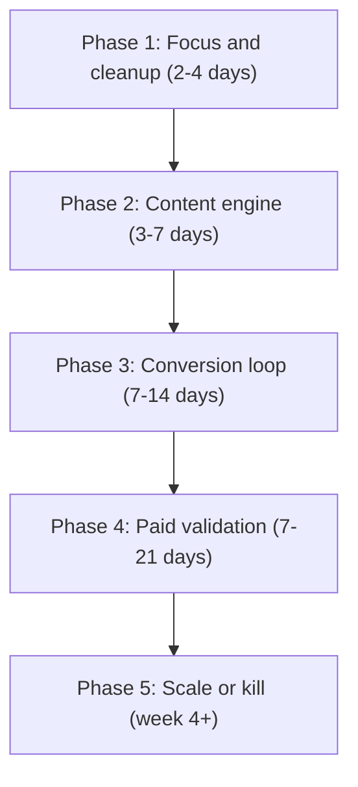
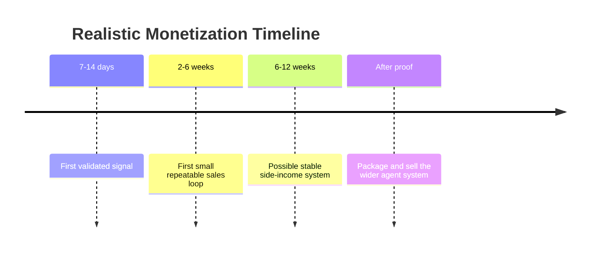
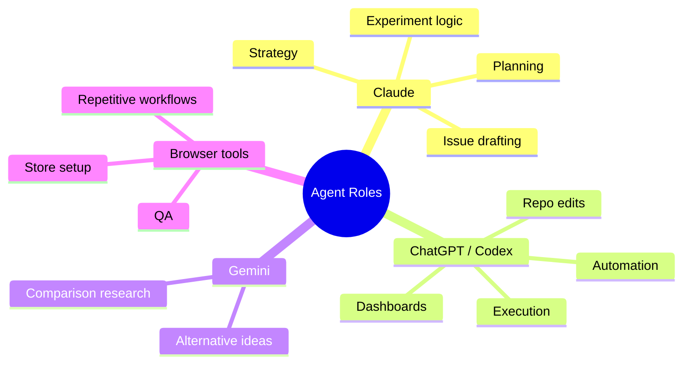

# Visual Roadmap

This page turns the command-center plan into a GitHub-friendly visual view.

## System View

## Revenue Priority

## Progress Snapshot

## 30-Day Execution Flow

## Timeline View

## Role Split

